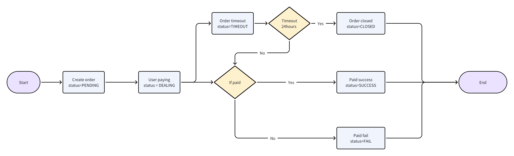

### 支付流程图




###  请求URL

- `{BaseURL}/gateway/payin/create`

### 请求方式

- POST

### 请求参数

| 参数名                | 必选  |类型| 说明                               |
|:-------------------|:----|:----- |----------------------------------|
| mch_id             | 是   |string | 商户号                              |
| mch_order_no       | 是   |string | 商户自生成订单号                         |
| mch_user_id        | 是   |string | 商户用户的唯一标识（如果想隐藏用户id明文，可以使用md5加密传递） |
| currency           | 是   |string | 支持【CNY,JPY,PHP,THD等】            |
| amount             | 是   |string | 99.11  单位元，支持到两位小数               |
| pay_method         | 否  |string | 支付方式，如果为空，自动选择可用的支付方式          |
| client_ip          | 是   |string | 下单用户的IP地址（一定要是用户的真实IP）           |
| notify_url         | 是   |string | 异步通知地址                           |
| return_url         | 否   |string | 同步跳转地址                           |
| payee_id           | 可选  |string | 【依据相关渠道】付款人身份证号                |
| payee_name         | 可选  |string | 【依据相关渠道】付款人姓名                 |
| payee_phone        | 可选  |string | 【依据相关渠道】付款人手机号                 |
| payee_bank_account | 可选  |string | 【依据相关渠道】 付款人银行卡号               |
| timestamp          | 是   |string | unix秒级时间戳                        |
| version            | 是   |string | 接口版本: v1.0                       |
|uuid  | 是  | string   | 请求ID: 550e8400-e29b-41d4-a716-446655440000 |
| sign               | 是   |string | 签名token                          |


### 请求参数示例

```
{
  "mch_id": "Q0P5T8DOGN10000",
  "mch_order_no": "TRADE-405189",
  "mch_user_id": "U405189",
  "currency": "CNY",
  "amount": "99.11",
  "pay_mehod": "GCASH",
  "notify_url": "https://x.com/notify",
  "return_url": "https://x.com/return",
  "timestamp": "1693233334134",
  "version": "v1.0",
  "uuid": "550e8400-e29b-41d4-a716-446655440000",
  "sign": "81930c5a04d1c58fd1efe33b06e2ffa7"
}
```

| 响应参数名(data)  |必选|类型| 说明                 |
|:-------------|:---|:----- |--------------------|
| order_no     |是  |string | 系统订单号              |
| mch_order_no |是  |string | 商户订单号              |
| currency     |是  |string | CNY, THD, PHP      |
| amount       |是  |string | 99.00  单位元，支持到两位小数 |
| channel_code |是  |string | 通道code，见文档上方通道描述部分 |
| pay_url      |是  |string | 支付链接，获取后跳转         |
| bank_name    |可选  |string | 银行名                |
| account_no   |可选  |string | 账号                 |
| account_name |可选  |string | 账户名                |

**返回示例**

```
{
  "code": 0,
  "message": "success",
  "uuid": "550e8400-e29b-41d4-a716-446655440000",
  "timestamp": "1693233334134",
  "data": {
    "mch_id": "MCH12345678",
    "mch_order_no": "23082822325936693122",
    "order_no": "MO202308282232593669984082",
    "currency": "USD",
    "amount": "59.12",
    "pay_method": "bank",
		"status": "PENDING",
    "pay_url": "https://pay.xxx.com/link/DyDpCjDfkr"
  }
}
```