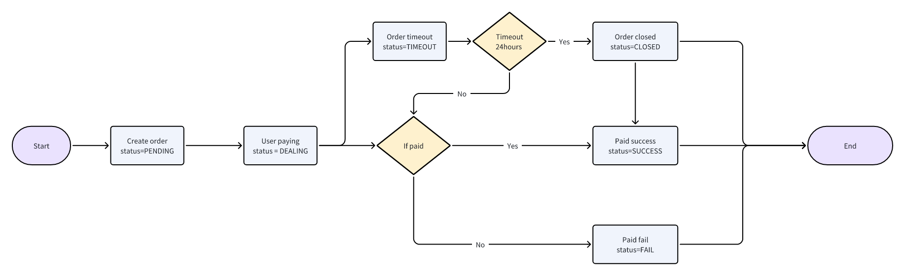

### 支付流程图



### 请求URL

`https://gateway.pay247.io/gateway/payin/query`

### 请求方式

POST

`timestamp` 使用整数，示例为毫秒；`version` 建议使用 `v3.0`。`sign` 需按[签名算法](/api-reference/cn/sign)计算。所有商户发往网关的请求都必须传 `uuid`，并将其计入签名。响应的 `uuid` 由响应头或服务端生成，不保证等于请求体中的 `uuid`。

## 请求参数

| 参数 | 必填 | 类型 | 说明 |
|---|---|---|---|
| `mch_id` | 是 | string | 商户号 |
| `mch_order_no` | 是 | string | 商户订单号 |
| `timestamp` | 是 | integer | 时间戳 |
| `version` | 是 | string | 建议 v3.0 |
| `uuid` | 是 | string | 请求标识 |
| `sign` | 是 | string | 签名 |

```json
{
  "mch_id": "MCH12345678",
  "timestamp": 1693233334134,
  "version": "v3.0",
  "uuid": "550e8400-e29b-41d4-a716-446655440000",
  "sign": "<computed signature>",
  "mch_order_no": "PAYIN-1001"
}
```

## 成功响应 data

| 参数 | 必填 | 类型 | 说明 |
|---|---|---|---|
| `mch_id` | 是 | string | 商户号，标识该订单所属商户 |
| `mch_order_no` | 是 | string | 商户提交的订单号 |
| `order_no` | 是 | string | Pay247 生成的平台订单号 |
| `currency` | 是 | string | 订单币种 |
| `pay_method` | 是 | string | 实际支付方式代码 |
| `pay_theme` | 是 | string | 支付主题，通常为 link 或 custom |
| `amount` | 是 | string | 订单金额，以订单币种计 |
| `fee` | 是 | string | 订单手续费，以订单币种计 |
| `status` | 是 | string | PENDING、DEALING、TIMEOUT、CLOSED、SUCCESS、FAIL、REFUND、UNDERPAID、OVERPAID |
| `utr` | 是 | string | 交易参考号，未产生时为空 |
| `error` | 是 | string | 错误信息，可能为空 |
| `actual_amount` | 否 | string | 成功、少付或多付时返回 |
| `pay_url` | 条件返回 | string | 未使用 custom 主题且通道未启用自定义返回时提供，尚未生成时可能为空 |
| `pay_params` | 条件返回 | object 或空字符串 | 自定义收款参数；custom 模式或支持自定义主题的通道返回，内容由通道决定，尚未生成时可能为空 |
| `network` | 仅 CRYPTO | string | 加密货币网络代码，仅 CRYPTO 订单返回 |
| `to_address` | 仅 CRYPTO | string | 链上收款地址，仅 CRYPTO 订单返回，尚未分配时可能为空 |
| `confirmations` | 仅 CRYPTO | integer | 链上确认数，仅 CRYPTO 订单返回 |
| `transaction_hash` | 仅 CRYPTO | string | 链上交易哈希，仅 CRYPTO 订单返回，未产生时为空 |

```json
{
  "code": 0,
  "message": "success",
  "uuid": "550e8400-e29b-41d4-a716-446655440000",
  "timestamp": 1693233334135,
  "data": {
    "mch_id": "MCH12345678",
    "mch_order_no": "PAYIN-1001",
    "order_no": "PI202609280001",
    "currency": "INR",
    "amount": "99.11",
    "pay_method": "UPI",
    "fee": "1.00",
    "pay_theme": "link",
    "utr": "",
    "error": "",
    "status": "PENDING",
    "pay_url": "https://checkout.example/pay/PI202609280001"
  }
}
```

### 示例：自定义收银台 INR 查询结果

此处保留原示例中的 `fee`、`utr` 和 `pay_params`；这些字段属于查询响应。

```json
{
  "code": 0,
  "message": "success",
  "uuid": "219bf2a2-8994-4ab0-b850-a5c1c70316e5",
  "timestamp": 1756736237009,
  "data": {
    "mch_id": "MCH12345678",
    "mch_order_no": "1119132492",
    "order_no": "PI202509012031309225639045",
    "currency": "INR",
    "amount": "23000.00",
    "pay_method": "UPI",
    "fee": "1495.00",
    "pay_theme": "custom",
    "utr": "395141536523",
    "error": "",
    "status": "PENDING",
    "pay_params": {
      "payee_name": "AJ ENTERPRISE",
      "payee_account_no": "ajenter66@sbi",
      "payee_bank_name": "",
      "payee_branch_name": "",
      "qr": "upi://pay?pa=ajenter66@sbi&pn=AJ ENTERPRISE&tn=O04T&am=22999.48&cu=INR&featuretype=money_transfer",
      "payee_phone": ""
    }
  }
}
```

### 示例：支付成功的订单

```json
{
  "code": 0,
  "message": "success",
  "uuid": "7eb3c9e-5a1d-4a19-be2a-c80eac39830a",
  "timestamp": 1594099906123,
  "data": {
    "mch_id": "MCH12345678",
    "mch_order_no": "Test20200707042747519753974848",
    "order_no": "P20200707042747519753974832",
    "currency": "USD",
    "amount": "99.11",
    "actual_amount": "99.11",
    "pay_method": "BANK",
    "fee": "1.99",
    "pay_theme": "link",
    "utr": "",
    "error": "",
    "pay_url": "https://pay.xxx.com/link/DyDpCjDfkr",
    "status": "SUCCESS"
  }
}
```
