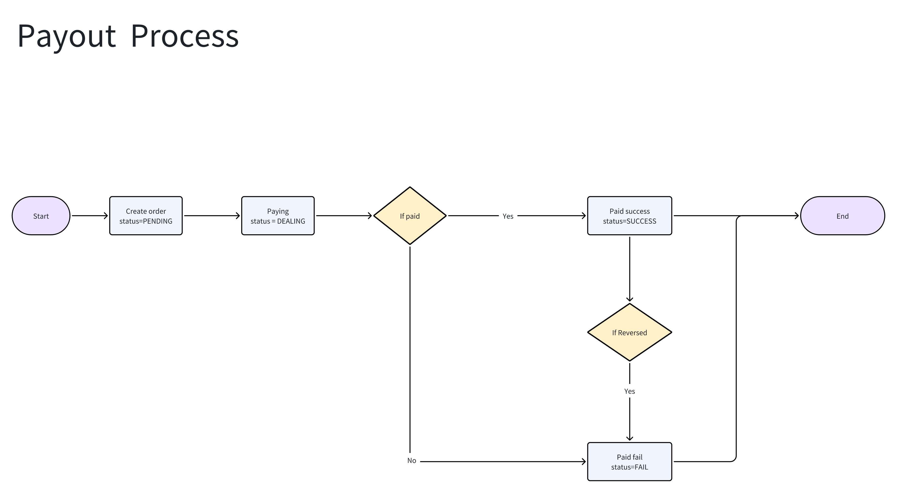

<Note>
**特别说明：代付请求结果未知时**

1. 调用代付接口时可能发生网络超时或未知异常（返回 `code=5000`）。此时交易结果未知，需要稍后调用[代付订单查询](/api-reference/cn/payout_query)获取最新状态。
2. 如果发生网络超时，可在 2 分钟后重试。重试前先使用相同的 `mch_order_no` 查询；确认订单不存在后，再使用同一订单号重试。
</Note>

### 代付流程图



### 请求URL

`https://gateway.pay247.io/gateway/payout/create`

### 请求方式

POST

`timestamp` 使用整数，示例为毫秒；`version` 建议使用 `v3.0`。`sign` 需按[签名算法](/api-reference/cn/sign)计算。所有商户发往网关的请求都必须传 `uuid`，并将其计入签名。响应的 `uuid` 由响应头或服务端生成，不保证等于请求体中的 `uuid`。

## 请求参数

| 参数 | 必填 | 类型 | 说明 |
|---|---|---|---|
| `mch_id` | 是 | string | 商户号 |
| `mch_order_no` | 是 | string | 商户唯一订单号 |
| `currency` | 是 | string | 订单币种 |
| `amount` | 是 | number | 金额，最多两位小数；须满足通道限额 |
| `pay_method` | 是 | string | 支付方式代码，见[目录](/api-reference/cn/pay_methods)；加密货币使用 `CRYPTO`，`TRC20` 和 `ERC20` 应填入 `network` |
| `account_no` | 条件必填 | string | 非 CRYPTO 时必填 |
| `account_name` | 条件必填 | string | INR 非加密货币代付必填 |
| `bank_code` | 条件必填 | string | INR 非加密货币代付须填 11 位 IFSC；其他币种按通道要求 |
| `network` | 条件必填 | string | CRYPTO 必填；USDT: TRC20/ERC20/BEP20，USDC: ERC20/BEP20 |
| `to_address` | 条件必填 | string | CRYPTO 必填；TRC20 为 T 开头的 34 字符地址，EVM 网络为 0x 加 40 位十六进制 |
| `memo` | 否 | string | CRYPTO 附言，最多 128 字符 |
| `bank_branch` | 否 | string | 银行支行 |
| `notify_url` | 否 | URL | 异步通知地址 |
| `mch_user_id` | 否 | string | 商户用户标识，可用于订单排查 |
| `channel_code` | 否 | string | 指定通道编码，仅与对接人员确认后使用 |
| `timestamp` | 是 | integer | 时间戳 |
| `version` | 是 | string | 建议 v3.0 |
| `uuid` | 是 | string | 请求标识，参与签名 |
| `sign` | 是 | string | 签名 |

```json
{
  "mch_id": "MCH12345678",
  "timestamp": 1693233334134,
  "version": "v3.0",
  "uuid": "550e8400-e29b-41d4-a716-446655440000",
  "sign": "<computed signature>",
  "mch_order_no": "PAYOUT-1001",
  "currency": "INR",
  "amount": "100.00",
  "pay_method": "BANK",
  "account_name": "Example Recipient",
  "account_no": "1234567890",
  "bank_code": "HDFC0001234",
  "notify_url": "https://merchant.example/notify/payout"
}
```

## 成功响应 data

| 参数 | 必填 | 类型 | 说明 |
|---|---|---|---|
| `mch_id` | 是 | string | 商户号，标识该订单所属商户 |
| `mch_order_no` | 是 | string | 商户提交的订单号 |
| `order_no` | 是 | string | Pay247 生成的平台订单号 |
| `currency` | 是 | string | 币种 |
| `amount` | 是 | string | 订单金额，以订单币种计 |
| `fee` | 是 | string | 订单手续费，以订单币种计 |
| `status` | 是 | string | 通常为 PENDING 或 CONFIRMING；后续请查询状态 |
| `network` | 仅 CRYPTO | string | 加密货币网络代码，仅 CRYPTO 订单返回 |
| `to_address` | 仅 CRYPTO | string | 链上收款地址，仅 CRYPTO 订单返回，尚未分配时可能为空 |
| `from_address` | 仅 CRYPTO | string | 链上转出地址，仅 CRYPTO 订单返回，未产生时可能为空 |
| `transaction_hash` | 仅 CRYPTO | string | 链上交易哈希，仅 CRYPTO 订单返回，未产生时为空 |
| `memo` | 仅 CRYPTO | string | 链上附言，仅 CRYPTO 订单返回，未填写时为空 |

```json
{
  "code": 0,
  "message": "success",
  "uuid": "550e8400-e29b-41d4-a716-446655440000",
  "timestamp": 1693233334135,
  "data": {
    "mch_id": "MCH12345678",
    "currency": "INR",
    "amount": "100.00",
    "fee": "2.00",
    "status": "PENDING",
    "order_no": "PO202609280001",
    "mch_order_no": "PAYOUT-1001"
  }
}
```

### 加密货币代付请求

```json
{
  "mch_id": "MCH12345678",
  "timestamp": 1693233334134,
  "version": "v3.0",
  "uuid": "550e8400-e29b-41d4-a716-446655440000",
  "sign": "<computed signature>",
  "mch_order_no": "PAYOUT-1002",
  "currency": "USDT",
  "amount": "50.00",
  "pay_method": "CRYPTO",
  "network": "TRC20",
  "to_address": "TFSPUcgpB4trALA6fqdK8AZ3KxoQjqjuB1",
  "notify_url": "https://merchant.example/notify/payout"
}
```

### 按国家/币种的代付参数

以下保留原有国家/币种接入说明；共同参数见上表，实际可用支付方式和银行字段仍由商户配置及通道要求决定。

### 印度（INR）代付请求参数说明

| 参数 | 必填 | 说明 |
|---|---|---|
| `mch_id` | 是 | 商户号 |
| `mch_order_no` | 是 | 商户订单号 |
| `currency` | 是 | INR |
| `amount` | 是 | 代付金额 |
| `pay_method` | 是 | BANK 为银行转账示例；实际开通方式见商户配置 |
| `account_name` | 是 | 收款人姓名 |
| `account_no` | 是 | 收款账号 |
| `bank_code` | 是 | 11 位 IFSC，如 HDFC0001234 |
| `notify_url` | 否 | 异步通知地址 |
| `timestamp` | 是 | 整数时间戳 |
| `version` | 是 | 建议 v3.0 |
| `uuid` | 是 | 请求标识，参与签名 |
| `sign` | 是 | 签名 |

### 菲律宾比索（PHP）代付请求参数说明

| 参数 | 必填 | 说明 |
|---|---|---|
| `mch_id` | 是 | 商户号 |
| `mch_order_no` | 是 | 商户订单号 |
| `currency` | 是 | PHP |
| `amount` | 是 | 代付金额 |
| `pay_method` | 是 | BANK 为银行转账示例；实际开通方式见商户配置 |
| `account_name` | 依通道 | 收款人姓名 |
| `account_no` | 是 | 收款账号 |
| `bank_code` | 依通道 | [银行代码](/api-reference/cn/banks/bank_ph) |
| `notify_url` | 否 | 异步通知地址 |
| `timestamp` | 是 | 整数时间戳 |
| `version` | 是 | 建议 v3.0 |
| `uuid` | 是 | 请求标识，参与签名 |
| `sign` | 是 | 签名 |

### 墨西哥（MXN）代付请求参数说明

| 参数 | 必填 | 说明 |
|---|---|---|
| `mch_id` | 是 | 商户号 |
| `mch_order_no` | 是 | 商户订单号 |
| `currency` | 是 | MXN |
| `amount` | 是 | 代付金额 |
| `pay_method` | 是 | BANK 为银行转账示例；实际开通方式见商户配置 |
| `account_name` | 依通道 | 收款人姓名 |
| `account_no` | 是 | 收款账号 |
| `bank_code` | 依通道 | [银行代码](/api-reference/cn/banks/bank_mx) |
| `notify_url` | 否 | 异步通知地址 |
| `timestamp` | 是 | 整数时间戳 |
| `version` | 是 | 建议 v3.0 |
| `uuid` | 是 | 请求标识，参与签名 |
| `sign` | 是 | 签名 |

### 示例：USDT 付款响应（CRYPTO）

```json
{
  "code": 0,
  "message": "success",
  "uuid": "550e8400-e29b-41d4-a716-446655440000",
  "timestamp": 1693233334135,
  "data": {
    "mch_id": "MCH12345678",
    "currency": "USDT",
    "amount": "50.00",
    "fee": "2.00",
    "status": "PENDING",
    "order_no": "PO202609280002",
    "mch_order_no": "PAYOUT-1002",
    "network": "TRC20",
    "to_address": "TFSPUcgpB4trALA6fqdK8AZ3KxoQjqjuB1",
    "from_address": "",
    "transaction_hash": "",
    "memo": ""
  }
}
```

### 原有代付成功创建示例（已修正响应字段）

```json
{
  "code": 0,
  "message": "success",
  "uuid": "7eb3c9e-5a1d-4a19-be2a-c80eac39830a",
  "timestamp": 1594099906123,
  "data": {
    "mch_id": "X3DSKDKII2343",
    "mch_order_no": "R898543254325432",
    "order_no": "202007070427475133333",
    "currency": "USD",
    "amount": "99.11",
    "status": "PENDING",
    "fee": "3.60"
  }
}
```
创建响应不包含原示例中的 `pay_method`、`paid_at`、`error`；需通过[代付订单查询](/api-reference/cn/payout_query)获取后续状态。
