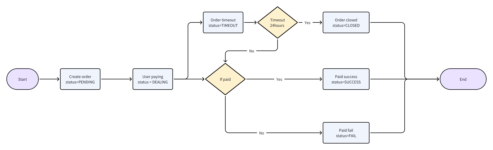

### The payin flowchart



###  Request URL

- `https://gateway.pay247.io/gateway/payin/create`

### Request Method

- POST

### Request Parameters

| Parameter | Must    | Type  |  Explanation  |
|:-------------------|:----|:----- |----------------------------------|
| mch_id             | Yes   |string | Merchant ID                              |
| mch_order_no       | Yes   |string | Merchant Order NO.                         |
| mch_user_id        | Yes   |string | Merchant User ID（You can use md5 to encrypt it） |
| currency           | Yes   |string | Support【CNY,JPY,PHP,THB, Please Contact BD】            |
| amount             | Yes   |string | 99.11                 |
| pay_method         | No  |string |  If leave it empty， the user will use our cashier to choose pay method          |
| pay_theme          | No  |string |  'link': pay247 cashier, 'custom': return pay params for custom cashier, If leave it empty， the user will use our cashier,       |
| notify_url         | Yes   |string | If the order changed will notify the server url                           |
| return_url         | No   |string | If paid success, will return to this url                           |
| payer_id           | No  |string | [Some pay method needs] the payer ID.               |
| payer_name         | No  |string | [Some pay method needs] the payer name              |
| payer_phone        | No  |string | [Some pay method needs] the payer phone                 |
| payer_account_no | No  |string | [Some pay method needs] the payer account_no          |
| timestamp          | Yes   |string | timestamp millisecond                     |
| version            | Yes   |string | v1.0                       |
| uuid  | Yes  | string   | Request ID: 550e8400-e29b-41d4-a716-446655440000 |
| sign               | Yes   |string | Signature                          |


### For example

```
{
  "mch_id": "Q0P5T8DOGN10000",
  "mch_order_no": "TRADE-405189",
  "mch_user_id": "U405189",
  "currency": "CNY",
  "amount": "99.11",
  "pay_mehod": "GCASH",
  "pay_theme": "link",
  "notify_url": "https://x.com/notify",
  "return_url": "https://x.com/return",
  "timestamp": "1693233334134",
  "version": "v1.0",
  "uuid": "550e8400-e29b-41d4-a716-446655440000",
  "sign": "81930c5a04d1c58fd1efe33b06e2ffa7"
}
```

### Response Data
| Parameter | Must    | Type  |  Explanation  |
|:-------------|:---|:----- |--------------------|
| mch_id     |Yes  |string | Merchant ID.              |
| order_no     |Yes  |string | System Order No.              |
| mch_order_no |Yes  |string | Merchant Order No.              |
| currency     |Yes  |string | CNY、 THB、PHP、VND... See more at backoffice      |
| amount       |Yes  |string | 99.11  |
| pay_method   |Yes  |string | pay method |
| pay_theme    |Yes  |string | pay theme, link: pay247 cashier, custom: for merhcant to custom cashier  |
| pay_url      |Optional  |string | payment url for theme of link,  need to redirect here        |
| pay_params   |Optional  |object | payment params for theme of custom, need to custom cashier page    |
| status    |No  |string | The order status                |

### For example (Cashier)

```
{
  "code": 0,
  "message": "success",
  "uuid": "550e8400-e29b-41d4-a716-446655440000",
  "timestamp": "1693233334134",
  "data": {
    "mch_id": "MCH12345678",
    "mch_order_no": "23082822325936693122",
    "order_no": "MO202308282232593669984082",
    "currency": "USD",
		"amount": "59.12",
		"pay_method": "BANK",
    "pay_theme": "link",
		"status": "PENDING",
    "pay_url": "https://pay.xxx.com/link/DyDpCjDfkr"
  }
}
```


### For example (Custom) Support JPY now

```
{
  "code": 0,
  "message": "success",
  "uuid": "550e8400-e29b-41d4-a716-446655440000",
  "timestamp": "1693233334134",
  "data": {
    "mch_id": "MCH12345678",
    "mch_order_no": "23082822325936693122",
    "order_no": "MO202308282232593669984082",
    "currency": "USD",
    "amount": "59.12",
    "pay_method": "BANK",
    "pay_theme": "custom",
    "status": "PENDING",
		"pay_params": {
			"payee_name": "日本測試卡",
			"payee_account_no": "123",
			"payee_bank_name": "三菱UFJ銀行",
			"payee_branch_name": "日本測試卡",
			"qr": ""
		}
  }
}
```