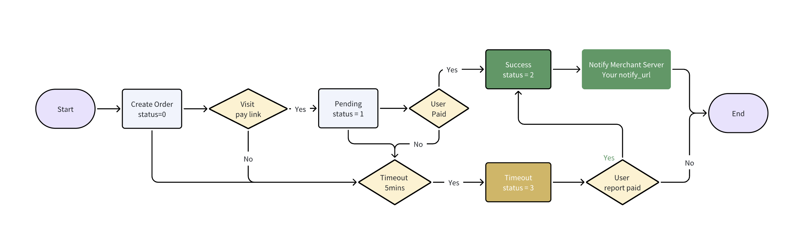

## 代收-统一下单

**通道描述：**


| 通道名称  | 通道编码     | 备注               | 营业时间 |
|:------|:---------|:-----------------|:------|
| 支付宝   | alipay   | 支持手机自动跳转APP、扫码支付 | 00:00~23:59 |
| 微信    | wechat   | 扫码支付             | 00:00~23:59 |
| 银联支付  | unionpay |  银联支付               | 00:00~23:59 |
| Gcash | gcash    | Gcash            | 00:00~23:59 |




**请求URL：**

- `接口域名/gateway/order/unified`

**请求方式：**


- POST

**请求参数：**

| 参数名                | 必选  |类型| 说明                               |
|:-------------------|:----|:----- |----------------------------------|
| mch_id             | 是   |string | 商户号                              |
| out_order_no       | 是   |string | 商户自生成订单号                         |
| currency           | 否   |string | 默认CNY,支持【CNY,PHP,THD】            |
| amount             | 是   |string | 99.00  单位元，支持到两位小数               |
| channel_code       | 是   |string | 通道code，见文档上方通道描述部分               |
| notify_url         | 是   |string | 异步通知地址                           |
| return_url         | 否   |string | 同步跳转地址                           |
| client_ip          | 是   |string | 下单用户的IP地址（一定要是用户的真实IP）           |
| user_id            | 是   |string | 用户的唯一标识（如果想隐藏用户id明文，可以使用md5加密传递） |
| payee_id           | 可选  |string | 【新增】付款人身份证号-风控使用                 |
| payee_name         | 可选  |string | 【网银必填】付款人姓名-风控使用                 |
| payee_phone        | 可选  |string | 【新增】付款人手机号-风控使用                  |
| payee_bank_account | 可选  |string | 【新增】 付款人银行卡号-风控使用                |
| timestamp          | 是   |string | unix秒级时间戳                        |
| version            | 是   |string | 接口版本: v2.0                       |
| sign               | 是   |string | 签名token                          |


**请求参数示例：**

```
{
  "mch_id": "Q0P5T8DOGN10000",
  "out_order_no": "405189",
  "currency": "CNY",
  "amount": "100.00",
  "channel_code": "wechat",
  "client_ip": "8.8.8.8",
  "notify_url": "https://x.com/notify",
  "return_url": "https://x.com/return",
  "timestamp": "1693233334",
  "version": "v2.0",
  "sign": "81930c5a04d1c58fd1efe33b06e2ffa7"
}
```

| 响应参数名(data)  |必选|类型| 说明                 |
|:-------------|:---|:----- |--------------------|
| order_no     |是  |string | 系统订单号              |
| out_order_no |是  |string | 商户订单号              |
| currency     |是  |string | CNY, THD, PHP      |
| amount       |是  |string | 99.00  单位元，支持到两位小数 |
| channel_code |是  |string | 通道code，见文档上方通道描述部分 |
| pay_url      |是  |string | 支付链接，获取后跳转         |
| bank_name    |可选  |string | 银行名                |
| account_no   |可选  |string | 账号                 |
| account_name |可选  |string | 账户名                |

**返回示例**

```
{
  "code": 0,
  "message": "success",
  "data": {
    "order_no": "MO202308282232593669984082",
    "out_order_no": "XX_5042373",
    "channel_code": "wechat",
    "bank_name": "", 
    "account_no": "",
    "account_name": "",
    "amount": "59",
    "pay_url": "https://pay.xxx.com/link/DyDpCjDfkr"
  }
}
```